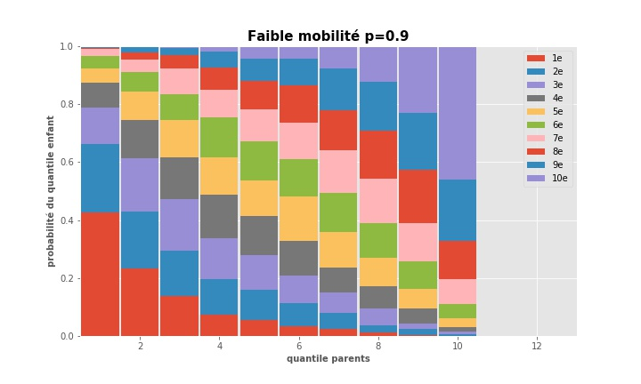
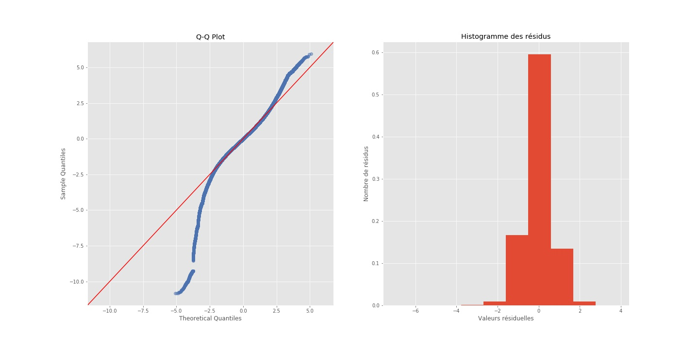

# Projet : Prédiction de revenus, cibler de nouveaux clients
### Projet du parcours Data Analyst OpenClassrooms en partenariat avec l’ENSAE-ENSAI.
Projet pour une banque présente dans plusieurs pays, l'objectif est de cibler les prospects les plus susceptibles d'avoir, plus tard dans leur vie, de hauts revenus.




## Préambule
Pour ce projet, les données ont été manipulées en Python. Analyse de statistique descriptive (avec des représentations graphiques). Modélisations de type ANOVA ou régression linéaire.

### Les données
*Data source 1:* [Fichier des données de la World Income Distribution, datée de 2008](https://s3-eu-west-1.amazonaws.com/static.oc-static.com/prod/courses/files/parcours-data-analyst/data-projet7.csv)\
*Data source 2:* [Indices de Gini estimés par la Banque mondiale](http://data.worldbank.org/indicator/SI.POV.GINI)

### Compétences évaluées
 - Maîtriser les bases de la statistique inférentielle
 - Maîtriser les bases des probabilités
 - Modéliser des données


## Prérequis techniques
Si vous n'avez jamais installé **Python**, alors autant installer directement la **distribution Anaconda**.
Anaconda est donc une distribution Python, faite pour la Data Science.

De cette manière on peut installer Python et ses librairies de Data Science Pandas, Matplotlib, Seaborn, Scipy, Numpy etc… 
Mais aussi le notebook Jupyter, qui reste incontournable et vivement recommandé!
C'est par ici : [Anaconda](https://www.anaconda.com/download)

Si vous souhaitez lancer le projet, il sera nécessaire d'installer Jupyter Notebook sur votre mahcine. 
La doc. Jupyter est accessible via : [Jupyter Documentation](https://jupyter.readthedocs.io/en/latest/install.html) 

```
python -m pip install --upgrade pip    
python -m pip install jupyter
```

Pour tester l'installation, vous pouvez taper dans votre console la commande suivante :

```
jupyter notebook
```

### Installation des librairies Python uniquement
*Pour installer python ainsi que les librairies de Data Science, il est fortement recommandé d'installer la distribution Anaconda.* 

```
pip install pandas
pip install matplotlib
pip install numpy
pip install scipy
```

## Auteur

**Nalron** *(Nicolas Pasero)* [Persona](https://nalron.com) - *Initial work* - [Github](https://github.com/nalron)
